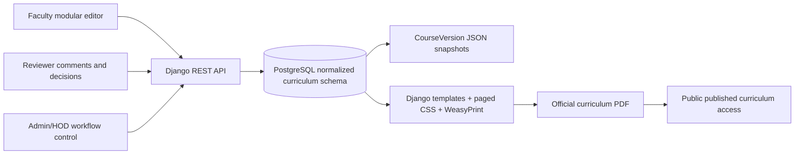

# Curriculum Management and Publishing System

Production-grade monorepo for a college engineering department to author, review, approve, version, and publish official curriculum documents from structured database content.

## Architecture Plan

The system follows this publishing pipeline:



Key decisions:

- Structured relational content is the source of truth. Raw PDFs are outputs only.
- Course editing is modular, section based, and workflow-aware.
- Versions are immutable snapshots with editor, timestamp, previous version, and rollback support.
- PDF generation uses HTML/CSS paged media templates and WeasyPrint.
- The official uploaded PDF template belongs in `CurriculumTemplate.template_pdf`; matching CSS and page partials live under `backend/templates/pdf`.
- JWT handles API authentication; role and object permissions enforce Admin/HOD, Faculty, Reviewer, and Public access.

## Database Schema

Core entities:

- `User`: custom Django user with `role`, `department`, designation, contact fields.
- `Department`: institution metadata, branding, logo.
- `AcademicYear`: active academic year range.
- `Semester`: department/year/semester structure.
- `Course`: structured course shell with status, type, teaching scheme, exam scheme, faculty assignment.
- `CourseOutcome`, `Module`, `Topic`, `Experiment`, `AssessmentScheme`, `ReferenceBook`: normalized syllabus sections.
- `CourseVersion`: immutable JSON snapshot, editor, timestamp, previous version.
- `ReviewerComment`: section-keyed review comments, resolution tracking.
- `ApprovalWorkflow`: workflow state transitions and decisions.
- `CurriculumTemplate`: official template metadata, source PDF, HTML/CSS configuration.
- `PublishedCurriculum`: generated public PDF/DOCX records.
- `Notification`, `AuditLog`: user notifications and protected route audit trail.

Supabase/PostgreSQL schema:

- Full SQL schema with enums, normalized tables, indexes, triggers, and RLS policies is available at [supabase/schema.sql](</C:/comps/supabase/schema.sql>).

Course states:

`DRAFT -> SUBMITTED -> UNDER_REVIEW -> CHANGES_REQUESTED -> APPROVED -> PUBLISHED -> LOCKED`

Faculty can edit draft/submitted/review/change-request states. Approved and published records require admin/HOD reopening.

## Folder Structure

```text
backend/
  apps/
    accounts/       custom user, roles, JWT-facing profile APIs
    curriculum/     normalized curriculum data, versions, editor APIs
    workflow/       reviewer comments and approval decisions
    publishing/     templates, WeasyPrint rendering, published PDFs
    notifications/  user notification feed
    audit/          API mutation audit logs
  config/           Django settings, URL router, ASGI/WSGI
  templates/pdf/    official PDF page templates and paged media CSS
  tests/            pytest model/API tests

frontend/
  app/              Next.js app routes
  components/       shell, UI primitives, modular curriculum editor
  hooks/            autosave hooks
  lib/              API client, validation, utilities
  types/            TypeScript domain types
  tests/            frontend validation tests

nginx/              reverse proxy for API, static/media, frontend
docker-compose.yml  PostgreSQL, backend, frontend, nginx
```

## API Design

Swagger/OpenAPI is available at `/api/docs/`.

Important routes:

- `POST /api/auth/token/`, `POST /api/auth/token/refresh/`
- `GET /api/auth/me/`
- `/api/departments/`, `/api/academic-years/`, `/api/semesters/`
- `/api/courses/`
- `POST /api/courses/{id}/submit/`
- `POST /api/courses/{id}/autosave/`
- `GET /api/courses/{id}/versions/`
- `POST /api/courses/{id}/rollback/`
- `POST /api/courses/{id}/reopen/`
- `GET /api/courses/{id}/preview_pdf/`
- `/api/course-outcomes/`, `/api/modules/`, `/api/topics/`, `/api/experiments/`
- `/api/assessment-schemes/`, `/api/reference-books/`
- `/api/reviewer-comments/`
- `POST /api/reviewer-comments/{id}/resolve/`
- `/api/approval-workflows/`
- `/api/curriculum-templates/`
- `POST /api/published-curricula/publish/`
- `GET /api/published-curricula/`

## Implementation Phases

Phase 1: project setup, auth, roles, database schema.

Phase 2: course management, semesters, faculty assignment.

Phase 3: modular curriculum editor with tabs and validation.

Phase 4: review/comment workflow.

Phase 5: versioning snapshots, comparison-ready history, rollback.

Phase 6: exact PDF rendering engine using reusable templates and `@page` CSS.

Phase 7: final curriculum assembly and public publishing.

Phase 8: Docker, nginx, environment structure, seed data, tests.

## Running Locally

1. Copy environment values:

```powershell
Copy-Item .env.example .env
```

2. Start the stack:

```powershell
docker compose up --build
```

3. Run migrations and seed data:

```powershell
docker compose exec backend python manage.py migrate
docker compose exec backend python manage.py seed_curriculum
```

4. Open:

- Frontend: `http://localhost`
- API docs: `http://localhost/api/docs/`
- Django admin: `http://localhost/admin/`

Seed users:

- `admin` / `ChangeMe123!`
- `faculty` / `ChangeMe123!`
- `reviewer` / `ChangeMe123!`

## Development Without Docker

Backend:

```powershell
cd backend
python -m venv .venv
.\\.venv\\Scripts\\Activate.ps1
pip install -r requirements.txt
python manage.py migrate
python manage.py seed_curriculum
python manage.py runserver
```

Frontend:

```powershell
cd frontend
npm install
npm run dev
```

## PDF Template Matching

The official PDF template is the source of truth. To tune exact output:

1. Upload/store the official PDF in `CurriculumTemplate.template_pdf`.
2. Put logos and seals under `backend/static/branding` or department media.
3. Adjust `backend/templates/pdf/base.html` for margins, typography, headers, footers, page numbers.
4. Adjust reusable page partials:
   - `course_detail.html`
   - `partials/course_body.html`
   - `curriculum_book.html`
5. Use `GET /api/courses/{id}/preview_pdf/` for faculty preview.
6. Use `POST /api/published-curricula/publish/` for final assembly.

The current implementation provides the exact rendering mechanism and a formal academic layout. Pixel-perfect matching requires the actual university PDF asset, logo files, fonts, and measured spacing from the uploaded source document.

## Testing

Backend:

```powershell
cd backend
pytest
```

Frontend:

```powershell
cd frontend
npm test
```

## Production Notes

- Set a strong `DJANGO_SECRET_KEY`.
- Set `DJANGO_DEBUG=False`.
- Restrict `DJANGO_ALLOWED_HOSTS`, `CORS_ALLOWED_ORIGINS`, and `CSRF_TRUSTED_ORIGINS`.
- Place nginx behind TLS or terminate TLS at the platform load balancer.
- Persist PostgreSQL, media, and static volumes.
- Review file upload scanning requirements for official templates and generated artifacts.
